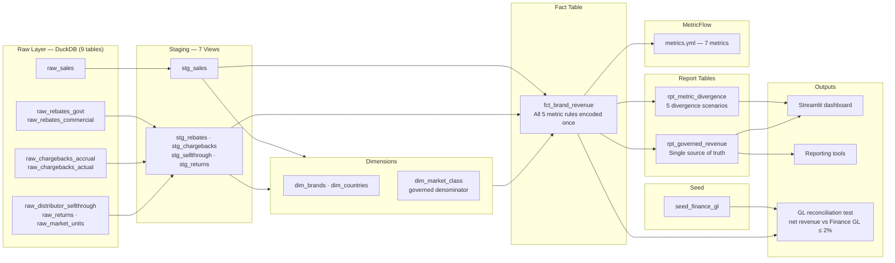

# dbt Metrics Layer — Pharma KPI Governance

A recurring pattern in pharma commercial analytics engagements: five brand teams each calculate
"net revenue" differently from the same source data — government rebates included by some,
excluded by others; chargebacks deducted on accrual basis by finance but on cash receipt by
commercial ops. Quarterly business reviews turn into 45-minute reconciliation meetings before
any decision gets made.

This POC encodes all metric definitions once in a dbt metrics layer. Every downstream consumer —
reporting dashboards, ad-hoc SQL, the Streamlit demo — reads from the same pre-calculated columns.
No room to diverge.

---

## Architecture



---

## The 5 Divergence Scenarios

### 1 — Rebate Netting (avg 37% variance across teams)

| Team | Reporting formula | Net revenue — Brand X, Jan |
|------|------------------|---------------------------|
| A — Global brand | Gross revenue, no deductions | $540,000 |
| B — Commercial ops | Gross − govt rebate | $443,000 |
| C — Market access | Gross − govt − commercial rebate | $405,000 |
| D — Finance | Gross − govt − commercial − chargeback | $389,000 |
| **Governed** | Pre-calculated `net_revenue` in `fct_brand_revenue` | **$389,000** |

**Root cause:** each team has a different formula in their own reporting tool for the same metric.
**Fix:** `fct_brand_revenue` applies all deductions once. Reporting tools connect to `rpt_governed_revenue`
and use `SUM(net_revenue)` — no business logic needed in the tool.

### 2 — Chargeback Timing (avg 2–3% swing per month)

Distributors submit chargeback claims 1–2 months after the original sale.

- **Finance (accrual basis):** estimates and deducts the expected chargeback in the sale month.
- **Commercial ops (cash basis):** deducts only when the chargeback invoice arrives.

Same month, different numbers. Compounds into meaningful annual variance when chargebacks are large.

**Governed rule:** accrual basis, aligned with the finance general ledger.
The GL reconciliation dbt test (`assert_net_revenue_reconciles_with_gl`) validates that
net revenue — the total after all deductions — ties to the Finance GL within 2%.

### 3 — Sell-Through vs Ship-In (avg 3–5% unit variance monthly)

Pharma ships product to distributors (ship-in). Distributors sell to pharmacies (sell-through).
When distributors build inventory, ship-in looks strong while sell-through lags — or vice versa.

| Method | What it measures | When to use |
|--------|-----------------|-------------|
| Ship-in | Units pharma shipped to distributor | Revenue recognition, aligns with GL |
| Sell-through | Units sold by distributor to pharmacy | Demand signal, patient access |

**Governed rules:** ship-in for revenue (aligns with GL), sell-through for demand reporting.
Both pre-calculated in `fct_brand_revenue` as separate columns — no ambiguity.

### 4 — Returns Date Allocation (avg 1–2% swing, significant for period-close)

A product returned in March for a December sale — does it reduce December or March revenue?

- **Finance:** booking month. December revenue is reopened and corrected.
- **Commercial ops:** return month. March takes the hit. December looks clean.

Period-close numbers, trend lines, and sales rep bonus calculations all diverge.

**Governed rule:** returns allocated to original booking month, consistent with GL period-close.

### 5 — Market Share Denominator (same brand, 3–4 percentage point spread)

Market share = brand units / total market units. "Total market" is defined differently:

| Denominator | Used by | Market share % — Cardivex US |
|-------------|---------|------------------------------|
| Total therapeutic class (incl. generics) | Global brand team | ~4% |
| Same sub-class only | Medical affairs | ~5% |
| Branded molecules only | Regional commercial | ~7% |

**Governed denominator:** sub-class total (branded + generic), agreed with Medical Affairs,
encoded in `dim_market_class` with an explicit flag. Visible, documented, testable.

---

## Cross-Industry Breadth

The same five divergence patterns appear across industries — the metric names change, the governance problem is identical:

| Divergence | Pharma | Retail | BFSI | SaaS |
|------------|--------|--------|------|------|
| **Definition** | Net vs gross revenue | Net GMV vs gross GMV | Net interest income | MRR with/without discounts |
| **Timing** | Ship-in vs sell-through | Booking date vs delivery | Trade date vs settlement | Contract start vs go-live |
| **Reversals** | Chargeback accrual vs cash | Return on booking vs return date | Loan reversal posting date | Churn on contract end vs last active day |
| **Denominator** | Total class vs sub-class market share | TAM definition for penetration % | NPL rate incl./excl. restructured | ARR with/without churned customers |
| **Inclusions** | Medicaid vs commercial revenue | Online vs in-store | Retail vs wholesale banking | Trial vs paid users |

---

## Design Decisions

**1. Pre-calculated marts over runtime reporting calculations**
The fix to divergent metrics is upstream, not downstream. Teams point their dashboards at
`rpt_governed_revenue` and SUM a pre-calculated column — no business logic in the reporting tool.
In production, schema-level access control (marts schema read-only, raw schema restricted)
enforces this without relying on team discipline.

**2. MetricFlow YAML as the formal definition layer**
The semantic model and metric definitions in `models/metrics/metrics.yml` are the contract.
In production with dbt Cloud's Semantic Layer API, reporting tools query MetricFlow-defined
metrics directly — the tool cannot write a divergent definition because it doesn't receive
raw columns, only a result set for the metric requested.
In this POC (dbt Core + DuckDB), the YAML is the documentation artifact; Streamlit reads from
the compiled mart tables (same result, no API needed).

**3. Accrual basis for chargebacks, not cash**
Aligns with GAAP revenue recognition and the finance GL. Cash basis creates a month-lag
that makes trend analysis misleading. The GL reconciliation test enforces alignment.

**4. Booking month for returns, not return month**
Consistent with period-close accounting. Return-month allocation artificially deflates future
periods and makes the original sale month look better than it was — bad for bonus calculations
and trend analysis.

**5. DuckDB for portability**
Zero cloud dependencies — the full stack (data generation + dbt + Streamlit) runs locally
with no credentials. The same dbt models run on Snowflake or BigQuery with only a `profiles.yml`
change. In production, reporting tools connect to the Snowflake mart layer via DirectQuery or
the dbt Cloud Semantic Layer API.

**6. GL reconciliation test as the governance enforcement mechanism**
`tests/assert_net_revenue_reconciles_with_gl.sql` compares governed net revenue against a
seeded finance GL reference within a 2% tolerance. This test is the technical artifact that
gives finance the confidence to sign off on the governed definition as the official number.
Once it passes, any team presenting a different number has to explain the deviation.

---

## What Production Looks Like

| This POC | Production |
|----------|------------|
| DuckDB file | Snowflake or BigQuery warehouse |
| `profiles.yml` change only | Same dbt models, zero SQL changes |
| Streamlit reads from DuckDB | Reporting tools connect to Snowflake mart tables |
| MetricFlow YAML (definition only) | dbt Cloud Semantic Layer API — reporting tools query metric definitions directly |
| Manual seed refresh | Airflow DAG orchestrating daily refresh |
| GL seed CSV | Live GL feed via CDC or daily extract |

---

## Stats

| | |
|---|---|
| dbt models | 14 (7 staging views + 3 dimension tables + 1 fact table + 2 report tables + time spine) |
| dbt tests | 12/12 passing (not_null × 8, unique × 1, accepted_values × 2, GL reconciliation × 1) |
| MetricFlow metrics | 7 defined in semantic model |
| Divergence scenarios | 5 |
| Data | 5 brands · 4 countries · 12 months · 240 brand/country/month records |
| Stack | Python 3.13 · dbt-core 1.11.11 · dbt-duckdb 1.10.1 · Streamlit |

---

## How to Run

```bash
# 1. Clone and set up
git clone https://github.com/ro-kannan/dbt-metricflow-pharma-analytics-governance
cd dbt-metricflow-pharma-analytics-governance
python3.13 -m venv .venv && source .venv/bin/activate
pip install -r requirements.txt

# 2. Generate raw data
python scripts/01_generate_pharma_data.py

# 3. Run dbt (builds all 14 models)
cd dbt_pharma_metrics
dbt seed --profiles-dir ..
dbt run --profiles-dir ..
dbt test --profiles-dir ..  # expect 12/12 passing

# 4. Launch dashboard
cd ..
streamlit run app.py
```

**Live demo:** https://dbt-metricflow-pharma-analytics-governance.streamlit.app

---

## Production Gaps (honest self-assessment)

- **Schema evolution:** no handling for new rebate types or new payer categories. Production would need dbt contract enforcement and a schema migration protocol.
- **Concurrent run handling:** DuckDB is single-writer. Production warehouse (Snowflake/BigQuery) handles concurrent dbt runs natively.
- **Semantic Layer API consumption:** the reporting tool connector to dbt Cloud's Semantic Layer API is documented but not built — requires a dbt Cloud account. The MetricFlow YAML in this repo is the definition artifact; the compiled SQL from `dbt compile` shows what it generates.
- **Access control enforcement:** the "restrict raw schema to marts only" governance mechanism is described but not implemented — requires warehouse RBAC (Snowflake roles/grants or BigQuery IAM).
- **Airflow orchestration:** daily refresh is manual (`dbt run`). Production would be a DAG: GL feed → dbt seed → dbt run → dbt test → alert on failure.
